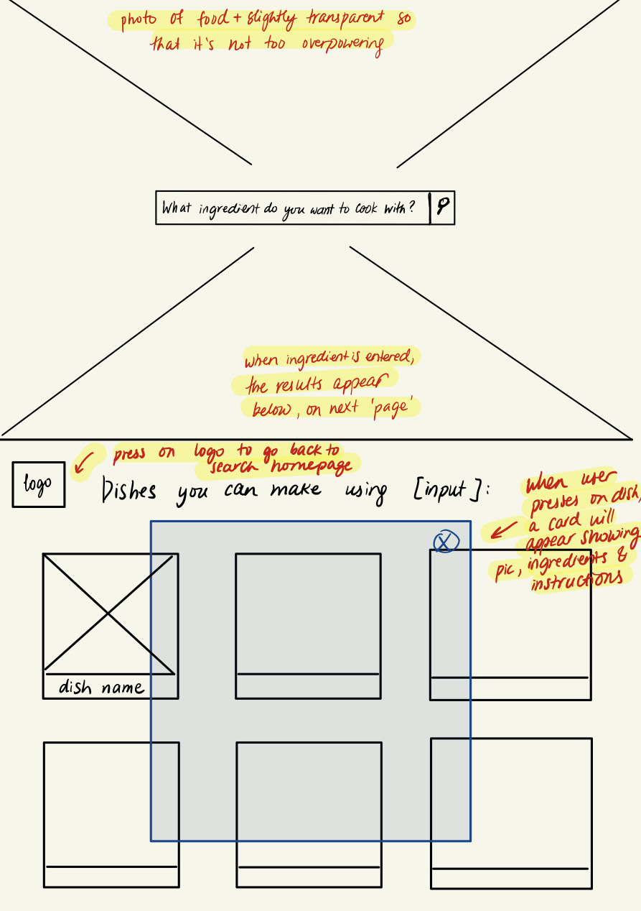
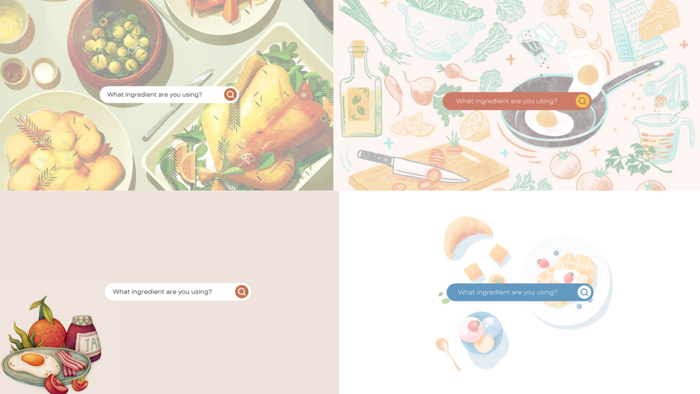
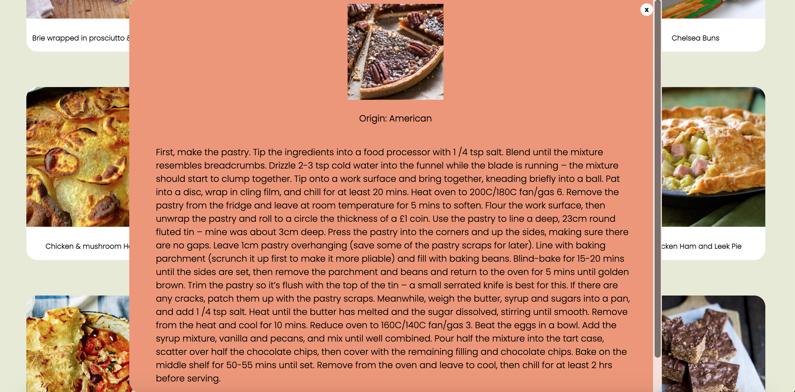
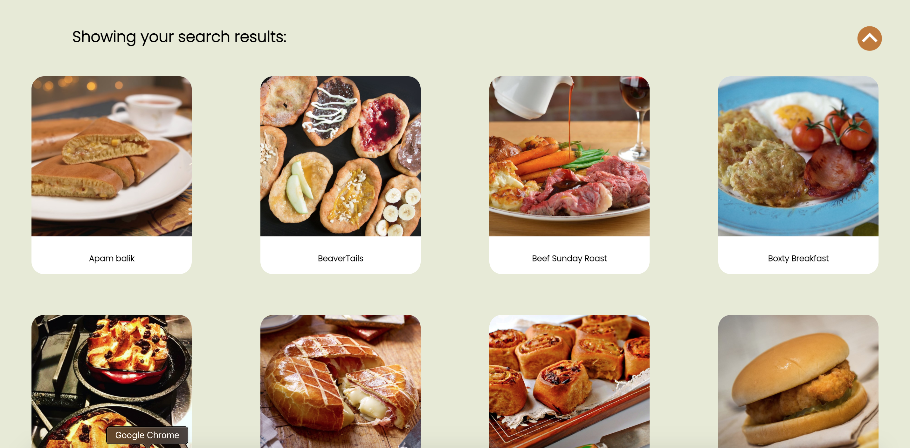
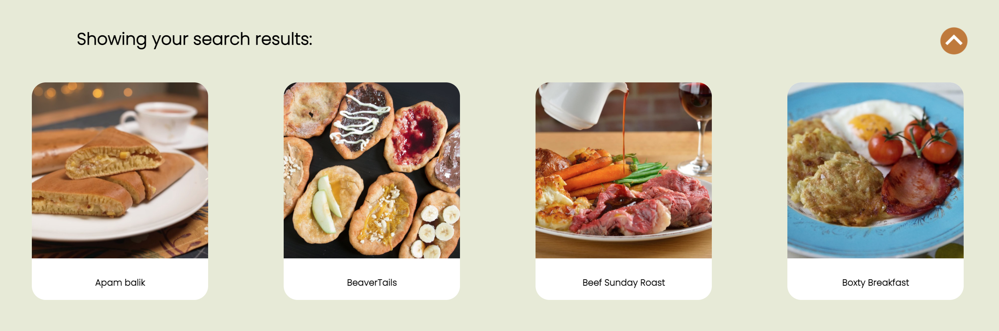

# Connections_Lab Project One
Project 1 - Create a web application that utilizes both a data set. The data you incorporate can be static or dynamic. Your web page should include at least a .html file, a .css file and a .js file. At least one user interaction is required. The interaction could be a user providing input to make a specific data request, a user affecting the webpage, or a user doing something else. 

See project [here](https://oyungerela.github.io/Connections_Lab/ProjectOne/index.html).

## Project Plan

### Inspiration
After giving some more thoughts, I decided to change my project idea to one that I felt more excited about. When I was back home, we (me and my family) always faced a big question every evening: "What to cook for dinner?". Some days this question would get resolved quite quickly, as there would be dish that we craved and wanted to make. But in other days, we would spend a long time thinking about the possible dishes we could make given available ingredients and ultimately decide on making a dish we already know how to make. In these thought-filled evenings, I rarely consulted a cooking recipe website, mostly because of my previous experiences with using a recipe websites. Most of the well-known websites are usually packed with too much information, from attention-deviating ads and difficult navigation bars to complex and long recipes on the main page that are irrelavant to the users' needs and wants. When a user is visiting the website for specific reasons, for example when seeking only the recipes using a certain ingredient, then being presented food and health articles, cocktail recipes, newsletter sign-up popup ads or kitchen equipment reviews is unnecessary, time-consuming and can often make the user experience less satifying and more tedious, as in the case of a few cooking websites I tried visiting. Therefore, my motivation for this project came from my personal experience and the desire to create an effortless and straightforward website that the user can easily search for recipes based on the ingredient they want to use, without being bombarded with irrelevant information and a crowded user interface. I wanted to make a website where the user is only shown what they seek. 
 
I expect my target audience to be people who regularly cook and are wishing to learn new recipes using the food items they have, but don't have a lot of time/interest in their hands to surf through large-scale cooking recipe websites. They could be working mothers/fathers, busy college students, anyone trying to experiment with different ingredients and those who prefer distractionless web visiting experience. 

### Design and Planning

It is important to think about how my web application can differ from other existing great recipe websites and what new features it can bring to the table. As mentioned, I plan to focus on creating a user interface that is free of distractions, effortless to use and bring to the user exactly the information they want and nothing more, nothing unnecessary. To reach this goal, my website will have a landing page with only a search bar that will ask the user to input a main ingredient they want to use in their dish and depending on what they input, different recipes will be shown down on the webpage where the user can click on and read the instructions about. By not having random food recipes and only having the search bar on the landing page, I expect the experience to be more intuitive and straightforward to use.



In terms of design, the AirBnB website was my main source of inspiration. For AirBnB, the user is welcomed by a landing page with a cozy photo that incites the user's want to travel. The focal piece in the website is the search bar where the user can enter their preferred location and arrival/departure dates. Once a location is entered, the user is navigated to a new page where the possible accomodations are displayed on individual cards with their image and price. 
The experience is very seamless and I wanted to emulate that in my website. Therefore, I decided to have only a search bar on my landing page where the user is asked to enter the ingredient they want to cook with, and based on what they enter, the screen will scroll down to the next 'page' where there will be list of dishes displayed on cards with their image and name. I decided to have everything on one single page for the ease of navigation, so there are no embedded html links. Moreover, the user can click on any dish displayed to read the instruction on how to make the dish. This information will be displayed in a pop-up box that can be closed using a button on its top right corner. 

After making the rough wireframe, I tried to create a design for my landing page on Canva. I first surfed through Google to find cute food illustrations I could use as a background and found a few images that I liked. I increased the transparency of the images slightly so that the background wouldn't disturb the other elements and located the search bar in the center to see how each one looked. While doing the design, I also tried a few fonts and decided to go with sans-serif thin font (Poppins specifically) as I wanted my website to have a simple yet modern vibe. Lastly, out of the four designs I made, I liked the color and ambience of the first one (green-ish background) the best and having the design ready, I finally started the coding process. 



### Process

I began with coding the landing page. At first I tried to put the background image in the body of the HTML file and then have the search bar have on top of it. However, this didn't work out as the search bar kept being not visible, and I guessed it was because image covered it, so I decided to add the image through CSS. 

```
body{
    background-image: url(images/background.png);
}
```

After positioning the search-bar on the screen, the search-bar looked a bit undermining because of the bright background image. I wanted to increase the transparency of the background image and tried changing the opacity of the body, but this applied to the whole screen, including the search bar. I made a quick Google search and found on StackOverflow that using linear gradient on the background image can help create a transparent-like effect.

```
body{
    background-image: linear-gradient(0deg, rgba(255, 255, 255, 0.4), rgba(255, 255, 255, 0.4)),url(images/background.png);
}
```

After finishing with the landing page, I started out coding the next page that was to contain the recipe list. Making the dish cards and pop-up info cards was a bit challenging. I first tried hard-coding (making a single dish card & pop-up card with static image and text) to plan the design and position all the elements. I specified everything in the CSS file and then deleted the code from the HTML file and began to populate the container through Javascript after fetching the data. I also spent a considerable amount of time trying to figure out how to capture which dish was clicked on by the user. After watching Youtube videos and browsing through MDN, I came across the HTML "data-" attribute which can be used to store information for a particular element. This "data-" attribute is easily accessible from the event object in a function, so I was able to add each of the dishes to the container with their meal ID as their "data-id". Therefore, when the user clicked on the dish list, I was able to access the data-id of div that was clicked and fetch the instruction of the meal accordingly. 

```
    // iterating over all the dishes
    for (let i=0; i<numRecipe; i++){
        // adding to the html variable a div for every dish that will hold each dish' name and image
        // adding a data-id with the id of the dish so that the individual dish can be identified when the user clicks on the dish list
        html += `
        <div class="recipe-item item${i}" data-id=${recipeList[i].idMeal}>
            <div class="recipe-img" data-id=${recipeList[i].idMeal}>
                
            </div>
            <div class="recipe-name" data-id=${recipeList[i].idMeal}>
                <h3 data-id=${recipeList[i].idMeal}>${recipeList[i].strMeal}</h3>
            </div>
        </div>
        `;
    }
```

```
    let dishID = e.target.parentElement.parentElement.dataset.id;
    // fetch the recipe information using the id of the dish
    fetch(`https://www.themealdb.com/api/json/v1/1/lookup.php?i=${dishID}`)
```

I wanted to have the background fixed in its position, so that when the screen was scrolled, only the content on the screen moved. Thus, I added a parallax effect, which was easily done with the below code. 

```
body{
    background-attachment: fixed;
    background-repeat: no-repeat;
    background-size: cover;
    background-position: center;
}
```

Just having the recipes by themselves on the screen felt a bit confusing, so I also added a text above the dishes, "Showing your search results". I initially wanted to have the text say "Showing results for [ingredient]" and tried to do this through Javascript by adding to the innerHTML of the text, but this didn't work out as ingredients kept being added to the text for every search result, i.e if the user searches for beef and then salmon, then the text would become "Showing results for beefsalmon". I worked on it for a while, but it still didn't work and since this was just a small detail, I decided to stick to just displaying the text without the ingredient. 

Another issue I had was that while testing the website, I found out that some of the dishes have very long instructions that overflow from the screen. I tried to fix it by making the overflow scroll. It didn't fully work for some of the dishes with really long instructions. Although the overflow was mostly scrollable, the text near the top of the screen went beyond the screen and wasn't able to be scrolled. 

```
.recipe-item-box{
    max-height: 100%;
    overflow-y: auto;
}
```



### Edits 

After getting valuable feedback from my peers, I made a few edits to my website. At the time of the presentation, I had not yet performed error-checking on the input, meaning that when the user entered an invalid ingredient, there was no observed change on my website. This could become a major issue if my website was to be made public and people started using it, thus I added a small snippet of code to my Javascript file to display an error message whenever there was an invalid input. Furthermore, I got a feedback that the screen looked a bit crowded when the dishes were displayed due to the background image which I also absolutely agreed with, so I added a solid color to the container of the dish list so that whenever the dishes were displayed, the background would be replaced by the color instead of the illustrated image. 





Another feedback that I got was that when the user entered an ingredient, the screen moved too fast so that it almost looked like the user was navigated to another HTML page instead of being scrolled down. After a quick Google search, I found a very easy way to make the scrolling behaviour smooth and slow. I only had to add the following line to my CSS code:
```
html{
  ...
  scroll-behaviour: scroll;
}
```

The last edit I made to my website since the presentation day is an up-button on the section where the dish list is displayed. This was added to help the users to go back to the search bar more easily. I wanted to align this button on the same level as the "Showing your search results" text but to the rightmost corner of the screen. However, making this happen was unexpectedly really challenging. I tried putting both items (text and the image of the button) in separate divs with the same parent element to use [display: 'flex'] and [justify-content: 'space-between'], but it did not work out. I then tried to use [display: 'inline-block']. It made the items appear on the same level but I wasn't able to add gap/space between them to have them exist on two sides of the screen. After exhausting my options, I decided to try to overlap the two items. I found on StackOverflow that using negative margin values can help with overlapping, so I tried it and it finally worked! I added a negative top-margin to the button (as it was added after the search text in the HTML code) and this allowed me to overlap the level of the two items so that they looked like they were on the same line. 
```
.up-btn{
    margin-top: -4rem;
}
```




### Next Steps

In the future, I hope to make the website more intuitive and practical to use. Even though the users search for recipes based on an ingredient, most of the dishes require many other ingredients that the user may or may not have. Thus, allowing the user to enter multiple ingredients or even input all the ingredients they have in their fridge and then finding a recipe that fits them can be helpful. Moreover, my website is still quite lacking in terms of design and reponsiveness. Although I tried my best to make the website responsive, some the items are positioned or sized a bit awkwardly, so I want to work on making the website fully responsive and comfortable to use on mobile. One of the feedbacks that I got during the presentation that I wasn't able to implement was making the instructions text organized and less bulky. This is something that is much needed for the ease of reading and understanding the recipes, so I hope to implement this in the future.
