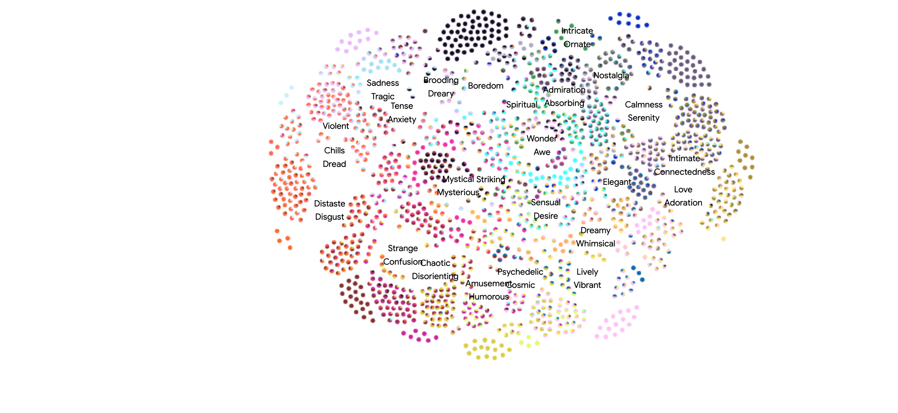

## Web Application Review
January 26, 2022

Art Emotions Map: https://artsexperiments.withgoogle.com/art-emotions-map/

### About the project
Art Emotions Map offers an insightful and educational sneak peek into the intersection between the arts and technology. It allows users to explore a wide variety of artsworks from different time periods and arts movements by the emotions they evoke, using data collected from 1,300 people on 1,500 paintings. By asking people to describe their feelings towards different paintings, the creators of the project were able to display the artsworks in different emotional groups for people to choose and explore about.

### Review
Overall, I really like the concept of the project. It opens up a freely accessible platform where people's views on art are brought together. The website is easy to navigate and has simple design – we can either choose an emotion first and pick an artwork from there or straight away pick a random painting to see the bar chart representation of the different emotions evoked in the general audience. I found it very fun to explore artworks and then use the bar chart to see how I feel matches with the average statistics. The initial color-coded bundled-up data visualization worked well and it made the website easier to understand and more intuititve. 

However, there were also some factors that I thought could be improved in the project. Firstly, during the 10-15 minutes I used the website, I came across a few awkward bumps in the website where it almost crashed or the webpage was unresponsive until I refreshed it. There were some cases where the previous content on the screen would lag while being exchanged by the new content. These small errors can slightly degrade the experience of exploring the beautiful content on the website. Secondly, some of the functionalities were not as easy to use as the rest. I kept scrolling on the trackpad to move up/down as I usually do for other applications, but on this website, it works as a zoom in/out, which was a bit awkward to use. I have to press on the trackpad and then scroll, which can be tricky if I’m not using a mouse. Moreover, I wished there was an option to use the right/left buttons on the keyboard to navigate between the artworks instead of having to press the buttons on the screen, which similarly would make the experience better when I’m not using a mouse. Thirdly, the content of the website could be made more interactive and relevant by allowing users to take part in the study. Right now, it is more of a data visualization project where it exhibits the emotions evoked by the 1,300 people who took part in the study. By having a quiz-like section on the website where people can look at artworks and choose from the different emotions to express how they feel about them, more data can be collected and the exhibition could become more alive and interactive. Lastly, it would be more educational to have a short textual description under each painting about the history behind the art so that users can learn a bit about each painting without having to look it up in Wikipedia everytime. 

I imagine that for a lot of people, myself included, going to galleries and looking at artworks is more of a personal-level activity and less of a community-based one. Thanks to this web application, I was able to not only look at a wide collection of neatly curated artworks but also compare my views on the artworks with a thousand other people and feel an artistic connection with the community. 

