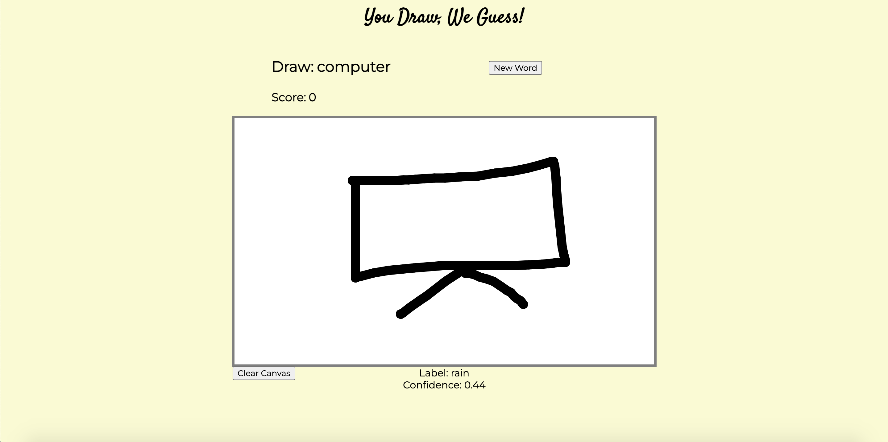

# Connections_Lab_Week11
Week 11 HW - Make a simple page with one of the following libraries - D3, Three.js, Ml5, Aframe, Tone.js, Rivescript, Leaflet. Ensure that you work with a library that you have not worked with before.

See project [here](https://oyungerela.github.io/Connections_Lab/Week11/).

## Planning and Process
For this week's homework, I decided to use the ML5 library. I got inspiration from the Google QuickDraw game as it was really intriguing, so decided to create a simpler version of it. On the ML5.js website, I found an example code for classifying doodles and labelling them accordingly and used it for my website. The code can be accessed [here](https://editor.p5js.org/ml5/sketches/ImageClassification_DoodleNet_Canvas). What the code does is it creates a canvas on p5.js and classifies the drawing on the canvas using the DoodleNet Image Classification model. I tried drawing doodles for a few times to see the labels that were frequently occurring and took note of them to use the words as a drawing prompt. I then saved the words into an array. 

```
// Array holding prompt words 
let words = ['computer', 'rain', 'sun', 'star', 'snake', 'dragon', 'microphone', 'apple', 'necklace', 'television', 'lightning', 'eye', 'mouth', 'book', 'wine_bottle', 'soccer_ball', 'cloud', 'moustache', 'coffee_cup', 'bracelet', 'diamond', 'pencil', 'sandwich', 'cake', 'toothpaste', 'speedboat', 'police_car', 'sword', 'snowflake', 'arm', 'leg', 'matches'];
```
Since most of the hard work was done already (the great thing about libraries!), I planned to add a scoreboard and prompt to make it more game-like. Using the words in the array, I display one word each time and ask users to draw the word. According to how the model labels the doodles, when the label matches  the prompt word, the score increases by 1, cheerful sound is played and the next word is shown. The game can be played endlessly. 




## Reflection
Although the prompt words come from the actual labels that the model knows, in a lot of the times, even when the doodle was clear and obvious, the classifier was unable to label the doodle correctly. Nevertheless, the machine learning model was still quite accurate in many instances. Working with the ML5 library was really interesting and I tried and enjoyed many of the examples, like video scavenger hunt and video sound, and became interested in learning about the process of training the models. After working with ML5, I feel like I have a stronger interest in Machine Learning and its creative applications, so it was an insightful experience overall.  
