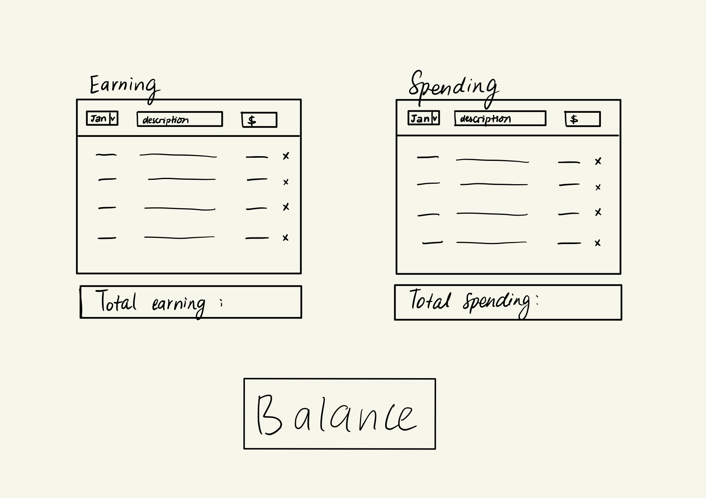
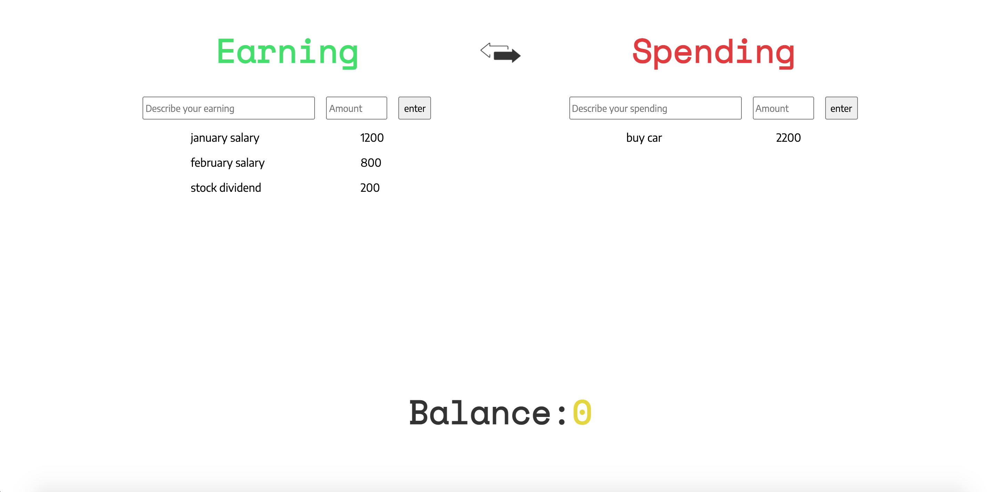

# Connections_Lab_Week2
Week 2 HW - Make a meaningful webpage that has at least two event-driven user interactions that are handled in a script.js file.

See project [here](https://oyungerela.github.io/Connections_Lab/Week2/).

## Planning

After spending quite some time trying to come up with an idea for my homework, I finally decided to create a budget tracker/personal finance tracker website. In the past, for a few times, I've looked for simple websites to note down my expenses and incomes, but never found one that I liked or found easy to use. Thus, my goal for this project was to create a webpage that allowed the user to enter their earnings and spendings and have their balance quickly calculated for them. My initial plan was to have 2 columns, one for earnings and another for spendings and get the month, transaction description and transaction value from the user to display the information down below on the respective columns. I also wanted to give the user the option to remove transactions in case they input the wrong info and improve usability. At the bottom of the screen, the balance would be displayed by calculating the (totalEarning-totalSpending). I planned the JS-based interactions to be inputting new transactions and removing transactions. In terms of design, I went for a simple, minimalist design, with no redundant information and a single-page webpage. 

## Process
This time around, I felt really comfortable working with flexbox and was able to create the initial skeleton of the webpage in a decent amount of time. I decided to leave out the month in the input section, mostly because I wasn't fully sure how I would make effective use of it in relaying the information entered by the user and I thought just having the description and value would make the website more minimalistic and the content easier to understand. Once I had the structure ready, I started working to add functionality to the input objects through capturing the information sent by the user and display it on the screen. I initially tried using the approach we used in class, which was to add an eventListener on the 'change' event of the input boxes individually and then dynamically adding the info by appending it to the empty div. It didn't work as planned, which was understable, since capturing the elements individually whenever the enter key was pressed didn't really make sense and it was more comfortable to have the entire information section displayed on the screen at the same time. Thus, I created a button to submit the information and add it onto the list. I also created an array for the different inputs which became useful to calculate the balance afterwards. The most difficult part was adding a remove button ('x') after each input row. This was because removing a row meant I also had to subtract from the balance the value of the transaction that was deleted, and as I made the mistake of not thinking of this sooner, I couldn't come up with a way to identify which row was being deleted without changing all my JS code. Thus, I could not continue with this feature. To replace the interactivity, I added a two-sided arrow button to give the users the ability to change the positions of the spending and earning columns. When I was creating my wireframe, I was debating between having the spending section on the left or right. For me, I mostly focus on tracking my spending so having it on the left made more sense to me, but I figured people may have different opinions, thus I translated this into a button so that users can change to a format they preferred.

## Reflection
I think this project has plenty of room for improvement in terms of design and user experience. In the future, I hope to add the remove button and month options like I initially planned. This would be helpful for the user to make little changes to the website without having to reload the page again and lose all their content. Having the month section would also make it possible to give some insight/statistics to the user in terms of spending frequencies and the month with the most/least transactions etc. On a good note, I finally made a fully-responsive website for the very first time, and now that I learned how to do it, I'll make sure to make all my future projects responsive. Overall, after this project, I feel more comfortable using Javascript and excited to actually learn back-end development so that I can complete the website and use it regularly in my life without losing my info everytime I refresh!

