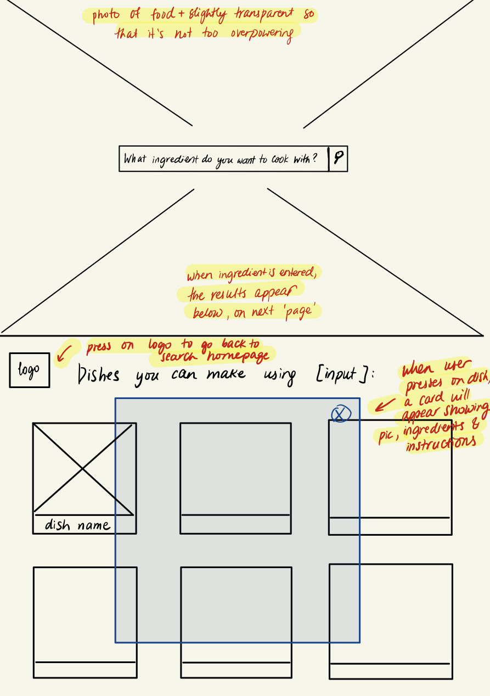

# Connections_Lab_Week3
Week 3 HW - Make an initial version of your project where data is displayed on the page either on page load or as a result of a user interaction.

See updated project [here](https://oyungerela.github.io/Connections_Lab/Week3/).

## Updated Project Plan

### Inspiration
After giving some more thoughts, I decided to change my project idea to one that I felt more excited about. When I was back home, we (me and my family) always faced a big question every evening: "What to cook for dinner?". Some days this question would get resolved quite quickly, as there would be dish that we craved and wanted to make. But in other days, we would spend a long time thinking about the possible dishes we could make given available ingredients and ultimately decide on making a dish we already know how to make. In these thought-filled evenings, I rarely consulted a cooking recipe website, mostly because of my previous not-so pleasant experiences with using a recipe websites. Most of the well-known websites are usually packed with too much information, from attention-deviating ads and difficult navigation bars to complex and long recipes on the main page that are irrelavant to the users' needs and wants. When a user is visiting the website for specific reasons, for example when seeking only the recipes using a certain ingredient, then being presented food and health articles, cocktail recipes, newsletter sign-up popup ads or kitchen equipment reviews is unnecessary, time-consuming and can often make the user experience less satifying and more tedious, as in the case of my own example. Therefore, my motivation for this project came from my personal experience and the desire to create an effortless and straightforward website that the user can easily search for recipes based on the ingredient they want to use, without being bombarded with irrelevant information and a crowded user interface. 

I expect my target audience to be people who regularly cook and are wishing to learn new recipes using the food items they have, but don't have a lot of time/interest in their hands to surf through large-scale cooking recipe websites. They could be working mothers/fathers, busy college students, anyone trying to experiment with different ingredients and those who prefer distractionless web visiting experience. 

It is important to think about how my web application can differ from other existing great recipe websites and what new features it can bring to the table. As mentioned, I plan to focus on creating a user interface that is free of distractions, effortless to use and bring to the user exactly the information they want and nothing more, nothing unnecessary. To reach this goal, my website will have a landing page with only a search bar that will ask the user to input a main ingredient they want to use in their dish and depending on what they input, different recipes will be shown down on the webpage where the user can click on and read the instructions about. By not having random food recipes and only having the search bar on the landing page, I expect the experience to be more intuitive and straightforward to use.

### Process
### Next Steps

Therefore, my motivation for this project came from my personal experience and the desire to create an effortless and straightforward website that the user can easily search for recipes based on the ingredient they want to use, without being bombarded with irrelevant information and a crowded user interface. 

# Previous Project Idea
## Planning
Coming up an idea for this project was very challenging. Although I had some ideas for web applications using data fetched from an API, for instance a book search app where the user inputs a genre and I display info on the current bestsellers with that genre, I was not entirely sure how I was going to use p5.js in visualizing the data in such applications. My thinking was that it would make more sense to use a dataset with meaningful numbers so I can use the values to create visualizations. Thus, I tried to look for datasets where the central data consists of number values. While browsing through different datasets and APIs, I came across a [website](https://ourworldindata.org/internet) that had a variety of information about the internet, its users, different applications that are used frequently etc. From there, I found data on some of the most used social media applications with their total user number and how much of the world's population use them by age group. I thought this would make a good topic to do my project on, as we all spend so much time on the internet, on social media and knowing data on knowing about its usage would be informative as well as thought-provoking. It would relay information on the connectedness of our world and the power of technology and social media in bringing people together. 

As my dataset is informative and quite applicable to everyone using the web, I consider my target audience to be all the people on the web hoping to learn more about social media applications and their usage globally. Since my app is for a wide range of people, I hope to make the design for my web app simple and intuitive to use, creating not only aesthetically pleasing but also straightforward and minimalist structure and design.  

## Process
The dataset I will be using contains the user information data on 5 social media applications, namely the number of users (as of 2019) and how much portion of each group (5 groups: 18-24, 25-29, 30-49, 50-64, 65+) use each application. I intend to create a circle visualization of each app, where the size/radius of the circle is determined by the relative size of the app or the number of users. In other words, the higher the number of users it has, the larger the circle will be representing the app. I also plan to add animations to the circle replicating a heart-beat (or the circle getting smaller and larger slowly and traces being left behind), to give the users the idea that these apps are alive and dynamic. I don't know how exactly I will do this as I don't have experience working with p5.js but I'll learn to make it during our workshops and by using Youtube videos. 

In terms of structure and design, the screen will be divided into two parts where the left-half will consist of the circles and the other half will be for textual information or the chart-like representations of users in terms of age-group. When the users hovers on the circle, the color of the circle will change (or other animation I will decide later on) and when the users presses on it, the heading will be changed and the later half of the screen will display information of the app represented by that circle. At this moment, my idea is still quite rough and I really hope I can get feedback from professor and my peers so I can make improvements. At this moment, I'm also debating whether to add more data onto the dataset, as right now, it only holds two types of information. I'll continue to give it more thought, but as of right now, this is the plan that I have. 

## Next Steps
For now, I have only fetched the data from my dataset and displayed it on my website. So my next steps would be to create the skeleton of my website, by making the respective containers and playing around with how I want my data to be exhibited. I'm a bit worried about my web application becoming too much of a data visualization page rather than a "web application", so I'll continue to give more thought on what interactions I could add to my webpage so that it becomes a more comprehensive and complete application that not only visualizes data but also gives the users a chance to interact with the data. 
